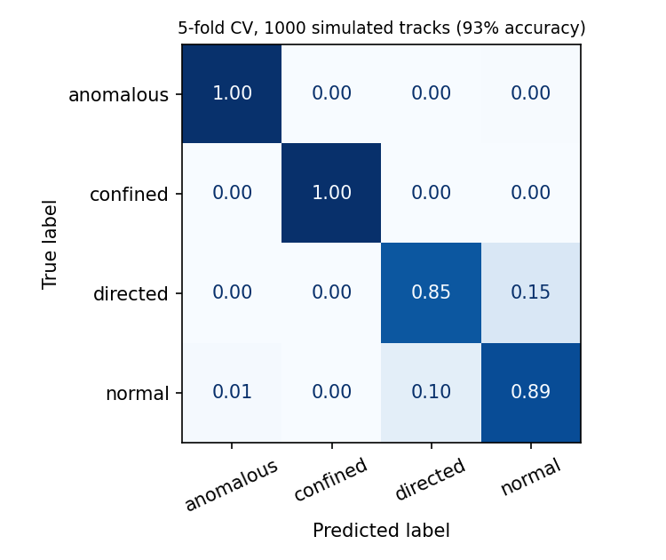

# spt-classify

Motion-type classification for 3D single-particle tracking, in Python.

Given a set of particle trajectories, this package extracts six interpretable
descriptors and classifies each track as **normal**, **directed**, **confined** or
**anomalous** diffusion. It is a Python implementation of the method in
[Chatterjee et al., *Chemical & Biomedical Imaging* (2025)](https://doi.org/10.1021/cbmi.5c00057),
which reports ~80% accuracy on experimental 3D SPT data.

On simulated trajectories with known ground truth, the pipeline reaches
**93% accuracy** across the four classes in 5-fold cross-validation.



Regenerate that panel with `python examples/make_confusion_matrix.py`; it uses
the same folds as the accuracy above, so the two always agree.

## Install

```bash
git clone https://github.com/jagriti12/spt-classify-.git
cd spt-classify-
pip install -e .
```

Requires Python 3.9+, NumPy and scikit-learn (1.2 or newer).

## Use it in 60 seconds

```python
from spt_classify import make_dataset, classify_tracks

tracks, labels = make_dataset(n_per_class=250, n_steps=100)
result = classify_tracks(tracks, labels)

print(result["accuracy_mean"])      # 0.933
print(result["feature_ranking"][0]) # ('trappedness', 1.17)
```

On your own data, pass a list of `(n_steps, 3)` NumPy arrays of positions:

```python
from spt_classify import extract_many

X = extract_many(my_tracks)         # (n_tracks, 6) feature matrix
predictions = result["model"].predict(X)
```

Or run the demo end to end:

```bash
python examples/demo.py
```

## The six descriptors

Selected from a larger candidate set by mRMR, NCA and ReliefF, keeping only the
descriptors all three agreed on.

| Descriptor | What it separates |
| --- | --- |
| Trappedness | Confined motion, via Saxton's confinement probability |
| Fractal dimension | Path-filling: ~1 directed, ~2 random, ~3 confined |
| MSD ratio | Departure from linear MSD growth; 0 for normal diffusion |
| Jump length | Mean frame-to-frame displacement; sets the motion scale |
| Kurtosis | Positions projected on the dominant gyration axis |
| Gaussianity | Fourth-moment deviation from Gaussian displacements |

Mutual-information ranking on simulated data puts trappedness, fractal dimension
and MSD ratio first, matching what the paper found on experimental trajectories.

## Why it is built this way

- **Localization error is simulated, not assumed away.** `make_dataset` adds
  Gaussian localization noise by default, because a classifier tuned on noiseless
  tracks will not survive contact with a microscope.
- **Interpretable features over end-to-end deep learning.** Six descriptors with
  physical meaning let you see *why* a track was labeled confined, which matters
  when the answer feeds a biological claim.
- **Short tracks are rejected, not silently mangled.** Tracks under 12 points
  raise an error rather than returning a feature vector built on three steps.
- **Confinement is enforced, not approximated.** A step that overshoots the
  sphere is folded back repeatedly until the particle is inside, so `confined`
  stays confined even when the step size approaches the confinement radius.

## Limitations

- Tuned and validated on 3D trajectories; 2D works but the descriptors that carry
  the most information change (kurtosis and gaussianity are largely 3D-specific).
- Simulated confined motion uses a reflecting sphere. Real confinement geometries
  are messier and accuracy on experimental data is correspondingly lower (~80%).
- Four classes only. Trajectories that switch state mid-track are labeled by the
  dominant mode; segment-level classification is a different problem.
- `classify_tracks(..., tune_model=True)` searches hyperparameters on the same
  folds it then scores, so that accuracy is a model-selection number, not a
  generalization estimate. The default (untuned) path is the honest one, and it
  is what the 93% above comes from.

## Tests

```bash
pytest
```

The suite checks feature behaviour against physics rather than just shapes: MSD
grows linearly for Brownian motion, directed tracks fill less space than random
ones, confined tracks score higher trappedness, and simulated confined tracks
never leave their sphere.

## Citation

> Chatterjee, J.; Chatterjee, S.; Gillett, E. N.; Kovalenko, N.; Fan, D.; Landes, C. F.
> Feature Selection and Hyperparameter Optimization for Machine Learned Classification
> of 3D Single-Particle Tracking. *Chem. Biomed. Imaging* (2025).
> DOI: [10.1021/cbmi.5c00057](https://doi.org/10.1021/cbmi.5c00057)

## License

MIT
